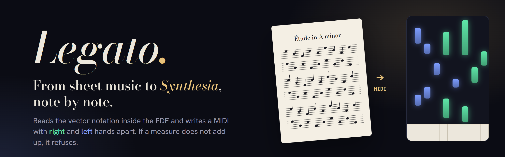
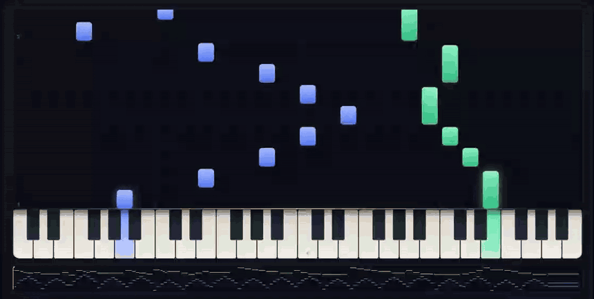
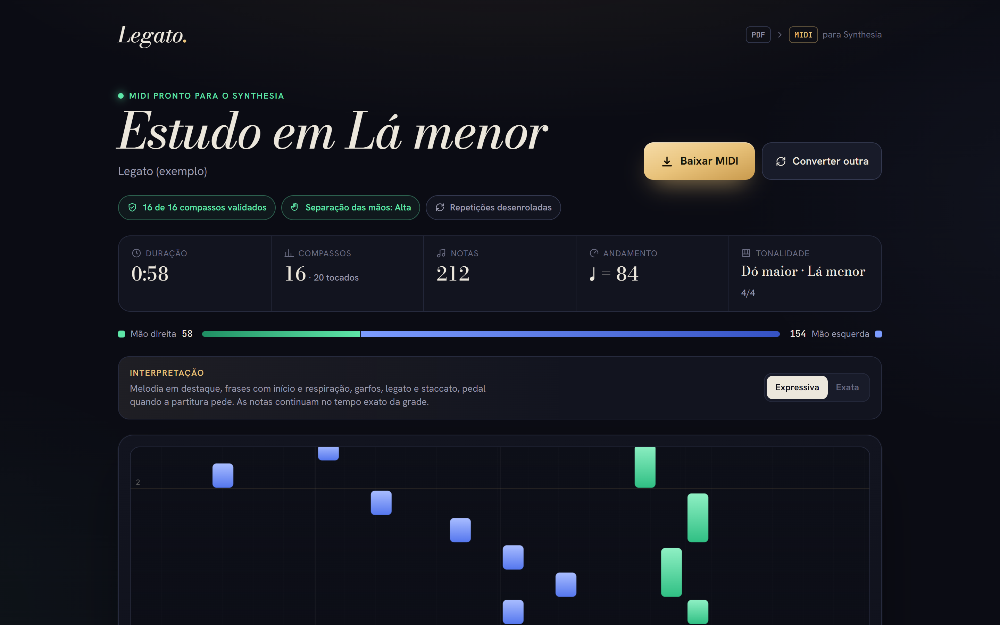
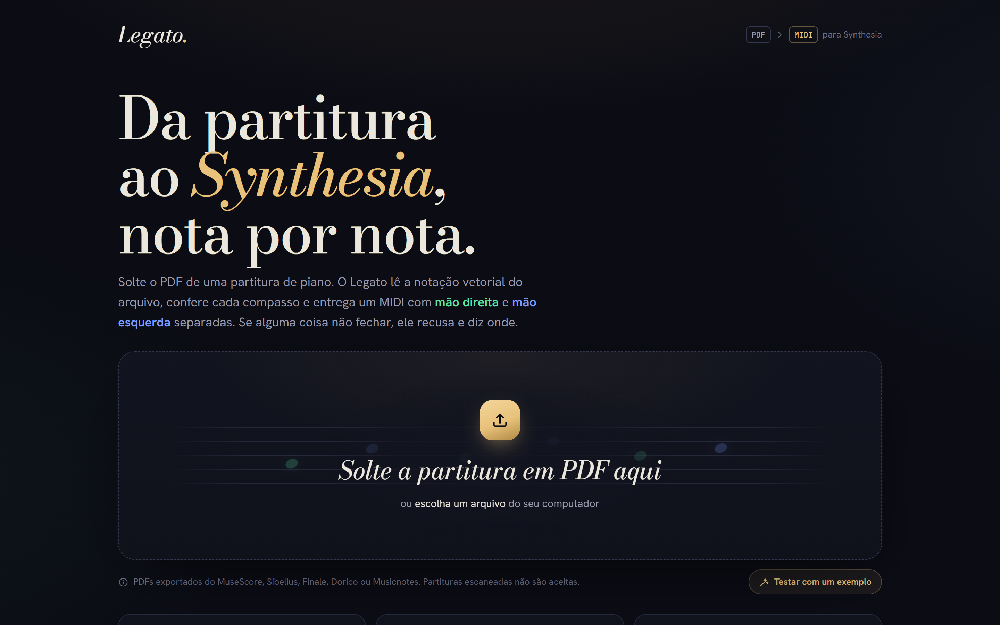
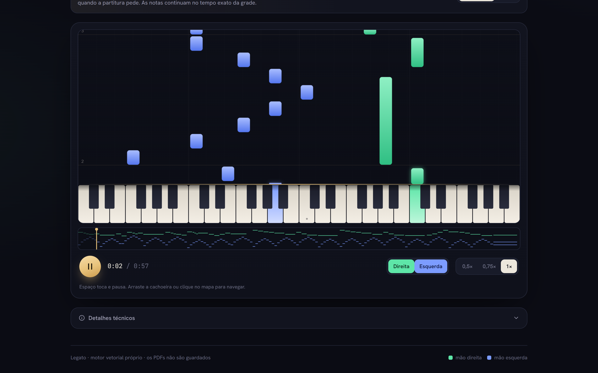
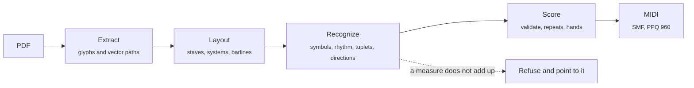

<div align="center">

<picture>
  <source media="(prefers-color-scheme: dark)" srcset=".github/assets/banner-dark.png">
  <source media="(prefers-color-scheme: light)" srcset=".github/assets/banner-light.png">
  
</picture>

<br>

<a href="#stack"></a>

<br><br>

**Drop a born-digital piano PDF, get a MIDI for Synthesia with the right and left hands on separate tracks.**<br>
If any measure cannot be reconstructed with certainty, Legato refuses and tells you where.

[How it works](#how-it-works) · [Getting started](#getting-started) · [Command line](#command-line) · [What is supported](#what-is-supported)

<br>



</div>

<br>

> [!NOTE]
> The interface is in Brazilian Portuguese. The sample score in the screenshots is an
> original étude written for the project.

## Why

Most PDF-to-MIDI tools run optical music recognition on a picture of the page and guess.
Scores exported from notation software do not need guessing: every notehead is a glyph
from a music font, with an exact position. Legato reads that vector data directly, solves
the rhythm of every measure, and **fails closed**: a measure that can be read in more
than one way blocks the whole MIDI instead of producing a wrong one.

## Features

|                                        |                                                                                                      |
| -------------------------------------- | ---------------------------------------------------------------------------------------------------- |
| 🎼 **Reads the vector, not the image** | Music-font glyphs and vector paths from mupdf.js. No OCR, no machine learning guesses.               |
| 🛑 **Refuses instead of guessing**     | Every measure must add up in exactly one way. A doubtful measure blocks the MIDI and is reported.    |
| ✋ **Hands and repeats resolved**      | Hand markings, repeats, 1st/2nd endings, Segno, Coda, D.S. and D.C. are unrolled into playing order. |
| 🎹 **Synthesia-ready**                 | Standard MIDI file, PPQ 960, with `Right Hand` and `Left Hand` tracks.                               |
| 🌊 **Preview before you download**     | Waterfall preview with piano playback, per-hand toggles and 0.5× to 1× speed.                        |
| 🎻 **Expressive or exact**             | Optional phrasing, hairpins, legato, staccato and pedal, while notes stay on the exact grid.         |

## Screenshots



<table>
  <tr>
    <td width="50%"></td>
    <td width="50%"></td>
  </tr>
  <tr>
    <td align="center"><b>Drop a PDF</b></td>
    <td align="center"><b>Preview and play</b></td>
  </tr>
</table>

## How it works

`POST /api/convert` streams each stage as NDJSON, so the page shows progress while the
engine works.



| Folder                 | What it does                                                  |
| ---------------------- | ------------------------------------------------------------- |
| `src/engine/pdf`       | Extracts music-font glyphs and vector paths with mupdf.js     |
| `src/engine/layout`    | Finds staves, grand-staff systems and barlines                |
| `src/engine/recognize` | Symbols, rhythm per measure, tuplets, dynamics and directions |
| `src/engine/score`     | Builds the score, resolves navigation and assigns hands       |
| `src/engine/perform`   | Optional expressive timeline                                  |
| `src/engine/midi`      | Writes the Standard MIDI File                                 |

Accuracy is measured end to end by a benchmark (`bench/`): it generates MusicXML as
ground truth, engraves it to PDF with MuseScore in several music fonts, converts it back
with Legato and compares the notes semantically.

The research behind the approach and the architecture decision are in
[`docs/research/pdf-to-midi-research.md`](docs/research/pdf-to-midi-research.md).

## Getting started

```bash
npm install
cp .env.example .env.local   # DATABASE_URL is optional
npm run dev
```

Open `http://localhost:3000` and press **Testar com um exemplo** to convert the sample
score.

Without `DATABASE_URL` everything works except the conversion history. With a
[Neon](https://neon.tech) Postgres URL, Legato stores the metadata, diagnostics and the
generated MIDI of each conversion (never the PDF). The table is created on first use, and
history is kept per browser.

## Command line

```bash
npx tsx scripts/convert.ts path/to/score.pdf      # writes fixtures/out/<name>.mid
npx tsx scripts/compare-variants.ts path/to/score.pdf  # expressive vs exact rendering
npx tsx bench/run.ts 20 "Leland,Bravura"          # benchmark, needs MuseScore (mscore) on PATH
```

## What is supported

Grand-staff piano scores exported from **Sibelius, MuseScore, Finale, Dorico or
Musicnotes**: chords, several voices, accidentals, key and time changes, clef changes,
ties, triplets and other simple tuplets, grace notes, repeats, 1st/2nd endings,
Segno/Coda/D.S./D.C./Fine, tempo marks, rit./a tempo, dynamics, hand markings.

**Not yet:** scanned PDFs (by design), nested tuplets, tremolos, 8va lines, multi-measure
rests, non-piano ensembles. These are rejected with a reason rather than converted
wrongly.

<a id="stack"></a>

## Stack

| Layer    | Technology                                    |
| -------- | --------------------------------------------- |
| App      | Next.js 16 (App Router), React 19, TypeScript |
| PDF      | mupdf.js                                      |
| Playback | Tone.js                                       |
| Database | Neon Postgres, optional                       |
| Deploy   | Vercel                                        |

## License

[MIT](LICENSE)

<br>

<div align="center">
<sub>Built by <a href="https://github.com/megomes">Matheus Ervilha</a> to learn real pieces in Synthesia.</sub>
</div>
